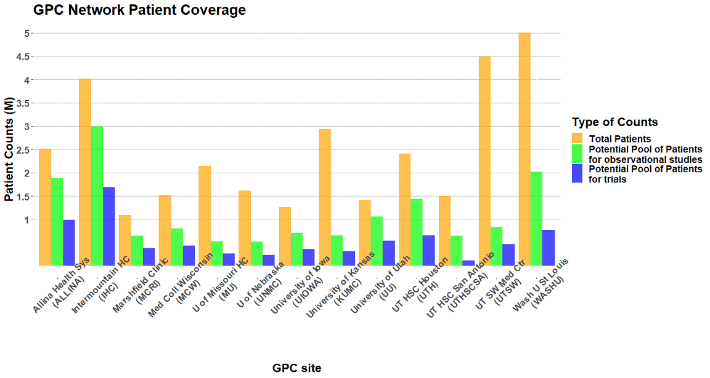
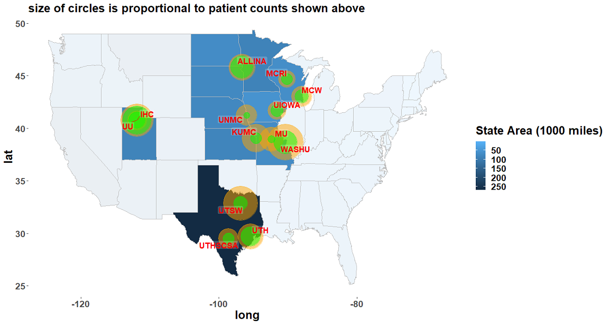

# GPC Reusable Observable Study Environment (GROUSE)
The Greater Plains Collaborative Clinical Data Research Networks (GPC CDRNs), is one of the 11 CDRNs included in PCORnet to further goals of the learning Health System and help to answer questions that are important to patient, clinician, and health system stakeholders. Current GPC includes 13 leading medical centers in 9 states (Kansas, Missouri, Iowa, Wisconsin, Nebraska, Minnesota, Texas, Utah, Idaho, Nevada, Wyoming) committed to a shared vision of improving healthcare delivery through ongoing learning, adoption of evidence - based practices, and active research dissemination.

In order to understand all types of care a patient receives without being restricted to specific health systems, the GPC Reusable Observable Unified Study Environment (GROUSE) – a de-identified data resource, is created by merging CMS claims (covering the entire 11 states) with GPC site EMR data. GPC CDRN selected three types of conditions - one rare disease (amyotrophic lateral sclerosis), one common disease (breast cancer), and obesity, to a) quantify completeness of the health system-derived data repositories; and b) evaluate the distributions of health and care processes for the patients within the GPC versus the larger Medicare and Medicaid populations in our region to understand how studies of the GPC population generalize to the broader populations in our states. To acknowlege the usage of GROUSE data, please include the following citation in your publication: 

```
Lemuel R Waitman, Xing Song, Dammika Lakmal Walpitage, Daniel C Connolly, Lav P Patel, Mei Liu, 
Mary C Schroeder, Jeffrey J VanWormer, Abu Saleh Mosa, Ernest T Anye, Ann M Davis, 
Enhancing PCORnet Clinical Research Network data completeness by integrating multistate 
insurance claims with electronic health records in a cloud environment aligned with CMS security 
and privacy requirements, Journal of the American Medical Informatics Association, 2021;
ocab269, https://doi.org/10.1093/jamia/ocab269*
```

For more details on GROUSE CMS DUA protocol, security policy and procedures, as well as other technical documents, please refer to the following resources: 
- [GROUSE Master Protocol]()
- [GROUSE CMS Executive Summary](doc/CMS_Executive_Summary.pdf)
- [GROUSE Data Management Plan Approval](doc/CMS_DPSP_DMP_Approval.pdf)
- [System Security Policy Deck](doc/SSP_Policy_Deck.pdf)
- [GROUSE Private Github Repository](https://github.com/gpcnetwork/GROUSE): _this private github repo contains more sensitive information about the environment, please reach out to ask-umbmi@umsystem.edu for access_

**********************************************************************************************

# Data Resources
## Electronic Health Records (EHR) and PCORnet Common Data Model (CDM)
GPC is a PCORnet Clinical Data Research Network (CDRN) bringing together a diverse population of 30 million patients from 13 health systems across 11 states (Kansas, Missouri, Iowa, Wisconsin, Nebraska, Minnesota, Texas, Utah, Idaho, Nevada, Wyoming, and portions of periperal states such as Chicago and Michigan). All GPC sites have aggregated longitudinal EHR data using the PCORnet CDM ensuring interoperability of data across multiple institutions.  





The current version of PCORnet CDM integrated on GROUSE contains curated clinical data over `2010-2020` from all 13 GPC sites, which includes patient demographics, vital signs, smoking history, labs mapped to LOINC codes, prescribing medication mapped to RXNORMs, dispensing medication mapped to NDC, procedures mapped to CPT/HCPCS and ICD10, diagnoses mapped to ICD9 and ICD10 codes. See [PCORnet CDM v6.0 Specifications](https://pcornet.org/wp-content/uploads/2022/01/PCORnet-Common-Data-Model-v60-2020_10_221.pdf) for mode details. 

*********************************************************************************************

## Medicare Research Identifiable Files (RIF)
Currently, the GPC coordinating center (GPC CC) recieves Medicare RIF files via windows compatible delivery media (i.e. USB hard drive, DVD, CD) from CMS chronic condition warehouse (CCW), or NewWave-GDIT, by mail. The raw files are in a compressed and encrypted format, called [Self-Decrypting Archives (SDAs)](https://innovation.cms.gov/files/x/bundled-payments-for-care-improvement-learning-area-size-info-doc.pdf). SDAs are stand-along executables that can only be decrypted and decompressed with encryption keys sent from CMS to GPC CC in separate secured email. After decryption and decompression each SDA executable, the actual data file (`.dat`) and the metadata file (`.fts`) and two additional (`.sas`) files were made available for downstream processing. GPC CC has implementated an ETL process leveraging the following key resources: AWS S3 bucket, AWS IAM, AWS Secret Manager, and Snowflake database. 
- **Medicare Enrollment and Beneficiary-Level (MBSF) file**: MBSF file, or denominator file, is created annually and contains demographic entitlement and enrollment data for beneficiaries who: 1) were part of the user-requested sample; 2) were documented as being alive for some part of the reference year; and, 3) were enrolled in the Medicare program during the file’s reference year. 
- **Medicare Provider Analysis and Review (MedPAR)**: The MedPAR file includes all Part A short stay, long stay, and skilled nursing facility (SNF) bills for each calendar year. MedPAR contains one summarized record per admission. Each record includes up to 25 diagnoses (ICD9/ICD10) and 25 procedures ((ICD9/ICD10) provided during the hospitalization
- **Outpatient Claims**: The outpatient file contains Part B claims for 100 percent for each calendar year from institutional outpatient providers. Examples of institutional outpatient providers include hospital outpatient departments, rural health clinics, renal dialysis facilities, outpatient rehabilitation facilities, comprehensive outpatient rehabilitation facilities, community mental health centers. In and out surgeries performed in a hospital will be in the hospital outpatient file, while bills for surgeries performed in freestanding surgical centers appear in the carrier claims, not in the outpatient file.
- **Carrier Claims (NCH)**: Since 1991, the Center for Medicare & Medicaid Services (CMS) has collected physician/supplier (Part B) bills for 100 percent of all claims. These bills, known as the National Claims History (NCH) records, are largely from physicians although the file also includes claims from other non-institutional providers such as physician assistants, clinical social workers, nurse practitioners, independent clinical laboratories, ambulance providers, and stand-alone ambulatory surgical centers. The claims are processed by carriers working under contract to CMS. Each carrier claim must include a Health Care Procedure Classification Code (HCPCS) to describe the nature of the billed service. The HCPCS is composed primarily of CPT-4 codes developed by the American Medical Association, with additional codes specific to CMS. Each HCPCS code on the carrier bill must be accompanied by a diagnosis code (ICD9, ICD10), providing a reason for the service. In addition, each bill has the fields for the dates of service, reimbursement amount, encrypted provider numbers (e.g., UPIN, NPI), and beneficiary demographic data.
- **Durable Medical Equipment Claims (DME)**: The Durable Medical Equipment (DME) file contains fee-for-service claims submitted by Durable Medical Equipment suppliers to the DME Medicare Administrative Contractor (MAC).
- **Part-D Drug Event**: When a Medicare beneficiary with Part D coverage fills a prescription, the prescription drug plan submits a record to CMS. The PDE file includes all transactions covered by the Medicare prescription drug plan for both Prescription Drug Plans (PDPs) and Medicare Advantage Prescription Drug Plans (MA-PDs).

## Transforming Medicare and Medicaid Research Identifiable Files into PCORnet CDM
For better interoperatability, we have transformed most parts of the Medicare RIF files (only FFS claims) into PCORnet CDM format except for charges and costs. We are currently working on developing transformation codes for Medicare Advantage data files, Medicaid TAF files, as well as designing and developing the process of augmenting PCORnet CDM to contain economic data transformed from Medicare/Medicaid charges and costs data.

Full technical details on data extraction, loading and transformation can be found in the following wiki page: 
> [Transform CMS RIF files into PCORnet CDM](https://github.com/gpcnetwork/grouse-cms/wiki/Transform-CMS-RIF-files-into-PCORnet-CDM) 
 

**********************************************************************************************

# Linkage and Deidentification
## Linkage
As described in full details in the GROUSE paper mentioned above, the deterministic data linkage between CMS claims and GPC CDM is provided by the CMS contractor, NewWave-GDIT, leveraging finder file and CMS referential database. 

## Deidentification
Abide by current GROUSE protocol, research data is required to be fully de-identified. We implemented the following [safe harbor rules](https://www.hhs.gov/hipaa/for-professionals/privacy/special-topics/de-identification/index.html):

1. Remove all the following [HIPAA-recognized identifiers](https://www.hhs.gov/hipaa/for-professionals/privacy/special-topics/de-identification/index.html#standard) from the data (note that many of them were not provided in source files): 
- (A) Names
- (D) Telephone Numbers
- (L) Vehicle identifiers and serial numbers, including license plate numbers
- (E) Fax numbers
- (M) Device identifiers and serial numbers
- (F) Email addresses
- (N) Web Universal Resource Locators (URLs)
- (G) Social security numbers
- (O) Internet Protocol (IP) addresses
- (H) Medical record numbers
- (P) Biometric identifiers, including finger and voice prints
- (I) Health plan beneficiary numbers
- (Q) Full-face photographs and any comparable images
- (J) Account numbers
- (R) Any other unique identifying number, characteristic, or code, except as permitted (e.g., fully deidentified identifier with no possibility of reidentifying an individual even linking to other data resources)
- (K) Certificate/license numbers

2. Date Obfuscation
- Randomly shift all real dates by a number between 1 and 365 at individual level. 
- At the time of data release, if the individual reaches the age of 90, his/her birth date will be masked as 1900-01-01. This rule is in consistency with [PCORnet CDM general guidance](https://pcornet.org/wp-content/uploads/2022/01/PCORnet-Common-Data-Model-v60-2020_10_221.pdf).

3. Location Obfuscation
- All geographic subdivisions smaller than a state, including street address, city, county, precinct, ZIP code, and their equivalent geocodes, except for the initial **three digits of the ZIP code** if, according to the current publicly available data from the Bureau of the Census. 

Full technical details of performing linkage and deidentification can be found from the following wiki page: 
> [Linkage and Deidentification](https://github.com/gpcnetwork/grouse-cms/wiki/Linkage-and-Deidentification).


**********************************************************************************************

# Auxilliary Data Files
## LOINC Ontology 
Logical Observation Identifiers Names and Codes (LOINC) is a database and universal standard for identifying medical laboratory observations. The LOINC database was downloaded from https://loinc.org/downloads/.

## RXNORM Ontology
RxNorm provides normalized names for clinical drugs and links its names to many of the drug vocabularies commonly used in pharmacy management and drug interaction software, including those of First Databank, Micromedex, Multum, and Gold Standard Drug Database. The RXNORM ontology files were downloaded from https://www.nlm.nih.gov/research/umls/rxnorm/docs/rxnormfiles.html with under appropriate licensing. 

## UMLS Metathesaurus
The UMLS Metathesaurus is a large biomedical thesaurus that is organized by concept, or meaning. It links synonymous names from over 200 different source vocabularies. The Metathesaurus also identifies useful relationships between concepts and preserves the meanings, concept names, and relationships from each vocabulary. The UMLS Metathesaurus full dataset were downloaded from https://www.nlm.nih.gov/research/umls/licensedcontent/umlsknowledgesources.html under appropriate licensing. 

## Grouper Valuesets
We have also released the following grouper valusets for research use: 
- ICD to [Clinical Classifications Software (CCS)](https://www.hcup-us.ahrq.gov/toolssoftware/ccs/ccs.jsp) mappings
- CPT to [Clinical Classifications Software (CCS)](https://www.hcup-us.ahrq.gov/toolssoftware/ccs/ccs.jsp) mappings
- ICD to [Phecode](https://phewascatalog.org/phecodes) mappings

**********************************************************************************************

# Geocoding and Public Data Files
Medicare and Medicaid claims (CMS RIF files) contains Zip+4 information for patients at each year of enrollment. We mapped the Zip+4 to Census Block Group and create a GEOID, which can be used to link to the following publically available, community-level data files. 

## American Community Survey
The American Community Survey (ACS) is an ongoing survey that provides data every year -- giving communities the current information they need to plan investments and services. The ACS covers a broad range of topics about social, economic, demographic, and housing characteristics of the U.S. population. We have loaded a selective sets of ACS variables from 2019 release. We have loaded the curated ACS data from https://github.com/UNMC-CRANE/SDH, and made it linkable to other datasets. 

## Area Deprivation Index
The Area Deprivation Index (ADI) is based on a measure created by the Health Resources & Services Administration (HRSA) over three decades ago, and has since been refined, adapted, and validated to the Census Block Group neighborhood level by Amy Kind, MD, PhD and her research team at the University of Wisconsin-Madison. We have loaded the 2020 ADI data downloaded from https://www.neighborhoodatlas.medicine.wisc.edu/ and made it linkable to other datasets. 

## Rural-Urban Commuting Area Codes
The rural-urban commuting area (RUCA) codes classify U.S. census tracts using **measures of population density, urbanization, and daily commuting**. We have loaded the 2010 RUCA (most recent release) from https://www.ers.usda.gov/data-products/rural-urban-commuting-area-codes/ and made it likable to other datasets. 


---------------------------------------------------------------------------------------------------
References: 
- [CMS to PCORnet CDM](https://github.com/PCORnet-DRN-OC/Medicare-Data-Transformation)
- [CMS to OMOP CDM](https://github.com/OHDSI/ETL-CMS)
- [CMS to Sentinel CDM](https://dev.sentinelsystem.org/projects/DCMS/repos/cms_medicare_ffs_datamart/browse?at=CMS_FFS_SCDMv8)
- [CMS Hospital Quality Initiative](https://www.cms.gov/Medicare/Quality-Initiatives-Patient-Assessment-Instruments/HospitalQualityInits)
- [Accessing Medicare Data at the Centers for Medicare and Medicaid Services using SAS](https://www.sas.com/content/dam/SAS/support/en/sas-global-forum-proceedings/2020/4285-2020.pdf)
- [Identify MA beneficiaries from MBSF](https://resdac.org/articles/identifying-medicare-managed-care-beneficiaries-master-beneficiary-summary-or-denominator)
- [MEDPAR vs. Inpatient file](https://resdac.org/articles/differences-between-inpatient-and-medpar-files)

---------------------------------------------------------------------------------------------------
*Copyright (c) 2021 The Curators of University of Missouri* <br/>
*Share and Enjoy according to the terms of the MIT Open Source License* <br/>
*Repo structure style follows [GitHub Repository Structure Best Practices](https://soulaimanghanem.medium.com/github-repository-structure-best-practices-248e6effc405) (Ghanem, 2021)*