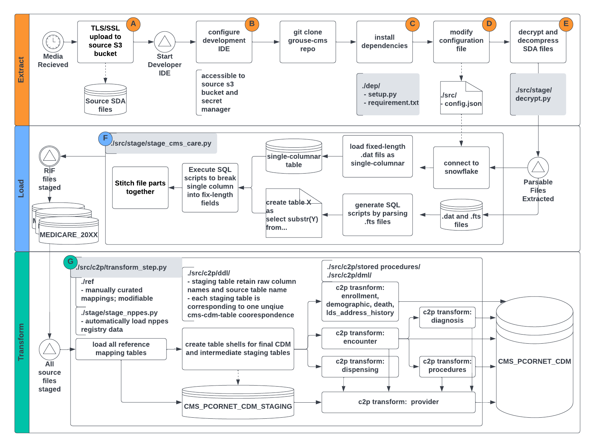
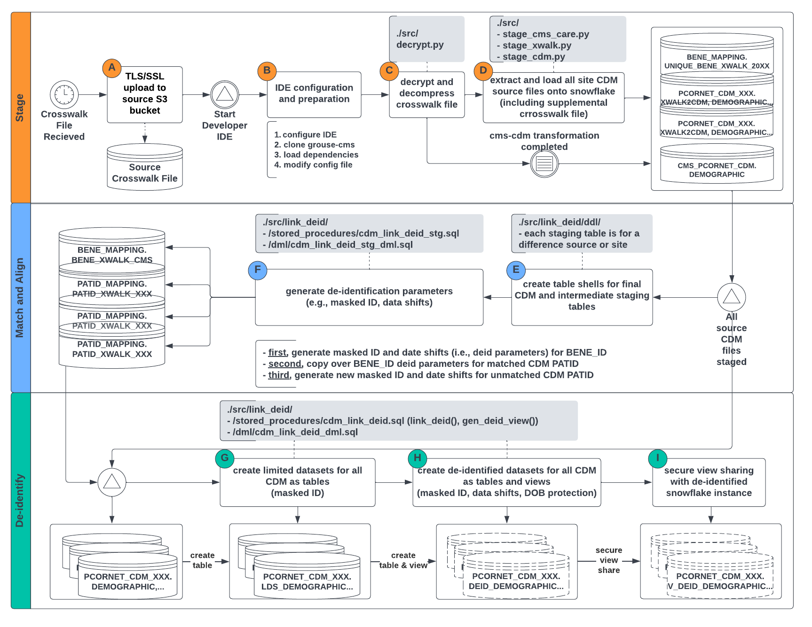

# GPC Reusable Observable Study Environment (GROUSE)
The Greater Plains Collaborative Clinical Data Research Networks (GPC CDRNs), is one of the 11 CDRNs included in PCORnet to further goals of the learning Health System and help to answer questions that are important to patient, clinician, and health system stakeholders. Current GPC includes 12 leading medical centers in 11 states (Kansas, Missouri, Iowa, Wisconsin, Nebraska, Minnesota, Texas, Utah, South Dakota, North Dakota and Indiana) committed to a shared vision of improving healthcare delivery through ongoing learning, adoption of evidence - based practices, and active research dissemination.

In order to understand all types of care a patient receives without being restricted to specific health systems, the GPC Reusable Observable Unified Study Environment (GROUSE) – a de-identified data resource, is created by merging CMS claims (covering the entire 11 states) with GPC site EMR data. GPC CDRN selected three types of conditions - one rare disease (amyotrophic lateral sclerosis), one common disease (breast cancer), and obesity, to a) quantify completeness of the health system-derived data repositories; and b) evaluate the distributions of health and care processes for the patients within the GPC versus the larger Medicare and Medicaid populations in our region to understand how studies of the GPC population generalize to the broader populations in our states. To acknowlege the usage of GROUSE data, please include the following citation in your publication: 

```
Lemuel R Waitman, Xing Song, Dammika Lakmal Walpitage, Daniel C Connolly, Lav P Patel, Mei Liu, 
Mary C Schroeder, Jeffrey J VanWormer, Abu Saleh Mosa, Ernest T Anye, Ann M Davis, 
Enhancing PCORnet Clinical Research Network data completeness by integrating multistate 
insurance claims with electronic health records in a cloud environment aligned with CMS security 
and privacy requirements, Journal of the American Medical Informatics Association, 2021;
ocab269, https://doi.org/10.1093/jamia/ocab269*
```

# Medicare Research Identifiable Files (RIF)
Currently, the GPC coordinating center (GPC CC) recieves Medicare RIF files via windows compatible delivery media (i.e. USB hard drive, DVD, CD) from CMS chronic condition warehouse (CCW), or NewWave-GDIT, by mail. The raw files are in a compressed and encrypted format, called [Self-Decrypting Archives (SDAs)](https://innovation.cms.gov/files/x/bundled-payments-for-care-improvement-learning-area-size-info-doc.pdf). SDAs are stand-along executables that can only be decrypted and decompressed with encryption keys sent from CMS to GPC CC in separate secured email. After decryption and decompression each SDA executable, the actual data file (`.dat`) and the metadata file (`.fts`) and two additional (`.sas`) files were made available for downstream processing. GPC CC has implementated an ETL process leveraging the following key resources: AWS S3 bucket, AWS IAM, AWS Secret Manager, and Snowflake database. 

# Transforming Medicare and Medicaid Research Identifiable Files into PCORnet CDM
The extract, load and transform (ELT) process can be summarised in the diagram below



### Extract and Load 
- A: [load source] The source SDAs files were first uploaded to a designated, encrypted S3 bucket via secured upload (TLS/SSL) 
- B: [configure development environment] Properly configure the chosen developer environment (e.g., local laptop, AWS cloud9 IDE, EC2 instance) to be accessible to source S3 bucket and S3 Secret Manager
- C: [install dependencies] Run `bash ./dep/setup.py` to install all required dependency libraries specified in the `./dep/requirement.txt` file
- D: [create config file] Open `./src/config.json` and fill out or modify required configuration information needed for running all the staging and transformation scripts
- E: [decrypt and decompress] Run `./src/stage/decrypt.py` in the configured developer environment  
- F: [extract and load] Run `./src/stage/stage_cms_care.py` in the configured developer environment  

### Transformation to PCORnet CDM
To improve interoperatability, we have implemented a process of transforming source Medicare RIF schema into PCORnet Common Data Model schema. Current transformation process is specific to Snowflake database. However, it can be easily adopted to PostGresql or MangoDB database backend (which supports stored procedure in javascript) but will require some adaptation to equivalent function objects in other types of databases. The following data lineage diagram demystifies how transformation is implemented associating the `.sql` scripts with source, intermediate, and target tables. The following list of entity relation diagrams (ERD) provides full data lineage details from source CMS RIF files to target CDM table (i.e., c2p transform).

- [ERD - c2p transform - enrollment](res/c2p_transform_enrollment.png)
- [ERD - c2p transform - demographic](res/c2p_transform_demographic.png)
- [ERD - c2p transform - death](res/c2p_transform_death.png)
- [ERD - c2p transform - lds_address_history](res/c2p_transform_lds_address_history.png)
- [ERD - c2p transform - encounter](res/c2p_transform_encounter.png)
- [ERD - c2p transform - diagnosis](res/c2p_transform_diagnosis.png)
- [ERD - c2p transform - procedures](res/c2p_transform_procedures.png)
- [ERD - c2p transform - dispensing](res/c2p_transform_dispensing.png)
- [ERD - c2p transform - obs_comm](res/c2p_transform_obs_comm.png)
- [ERD - c2p transform - payer_plan_period](res/c2p_transform_payer_plan_period.png)
- [ERD - c2p transform - cost](res/c2p_transform_cost.png)

G: Run parts of the `c2p/transform_step.py` on the configured developer environment. You may want to start with running the transformation step by step to identify and fix any bugs should there be any. The script consist of three parts: 
1) create table shells by running the DDL (data definition lanugaue) scripts in `./src/ddl`; 
2) load reference concept mapping tables pre-loaded in `./ref/` folder; 
3) run stored procedures in `./src/stored_procedures` for staging and transformation; 
3) stage source CMS tables in the staging area in a 1-to-1 fashion (i.e. 1 source table to 1 target table), including applying all the mapping tables and creating de-duplication indices (`./src/dml`); 
4) perform the final transformation step and write to target CDM table (`./src/dml`).  

For fully automated transformation, you can run `c2p/transform_full.py` on the configured developer environment without commenting out any steps, which runs all the steps mentioned above without requiring any human intervention. However, we would recommend running the stepwise transformation at least once to validate the underlying sql scripts.     

# Linkage and Deidentification


- A: [load source] The source SDAs files were first uploaded to a designated, encrypted S3 bucket via secured upload (TLS/SSL) 
- B: [configurattion and preparation] The same as steps B to D from the ELT process above
- C: [decrypt and decompress] Run `./src/stage/decrypt.py` in the configured developer environment  
- D: [extract and load] Run `./src/stage/stage_cms_care.py`, `./src/stage/stage_xwalk.py`, and `./src/stage/stage_cdm.py` to stage all needed source files onto snowflake
- E-F: [match and align] Run stored procedures `./src/link_deid/stored_procedures/cdm_link_deid_stg.sql` and `./src/link_deid/dml/cdm_link_deid_stg.sql`to create intermediate tables specifying all de-identification parameters
- G-I: [deidentify and secure share] Run stored procedures `./src/link_deid/stored_procedures/cdm_link_deid.sql` to create LDS and De-identified tables of all the CDM data. 
- 

# Database Catalog
|Database|Schema|Object|Name|
|--------|------|------|----|
|GROUSE_DB|CMS_PCORNET_CDM|VIEW|V_DEID_ADDRESS_HISTORY|
|GROUSE_DB|CMS_PCORNET_CDM|VIEW|V_DEID_DEATH|
|GROUSE_DB|CMS_PCORNET_CDM|VIEW|V_DEID_DEMOGRAPHIC|
|GROUSE_DB|CMS_PCORNET_CDM|VIEW|V_DEID_DIAGNOSIS|
|GROUSE_DB|CMS_PCORNET_CDM|VIEW|V_DEID_DISPENSING|
|GROUSE_DB|CMS_PCORNET_CDM|VIEW|V_DEID_ENCOUNTER|
|GROUSE_DB|CMS_PCORNET_CDM|VIEW|V_DEID_ENROLLMENT|
|GROUSE_DB|CMS_PCORNET_CDM|VIEW|V_DEID_PROCEDURES|
|GROUSE_DB|PCORNET_CDM_ALLINA|VIEW|V_DEID_CONDITION|
|GROUSE_DB|PCORNET_CDM_ALLINA|VIEW|V_DEID_DEATH|
|GROUSE_DB|PCORNET_CDM_ALLINA|VIEW|V_DEID_DEATH_CAUSE|
|GROUSE_DB|PCORNET_CDM_ALLINA|VIEW|V_DEID_DEMOGRAPHIC|
|GROUSE_DB|PCORNET_CDM_ALLINA|VIEW|V_DEID_DIAGNOSIS|
|GROUSE_DB|PCORNET_CDM_ALLINA|VIEW|V_DEID_DISPENSING|
|GROUSE_DB|PCORNET_CDM_ALLINA|VIEW|V_DEID_ENCOUNTER|
|GROUSE_DB|PCORNET_CDM_ALLINA|VIEW|V_DEID_ENROLLMENT|
|GROUSE_DB|PCORNET_CDM_ALLINA|VIEW|V_DEID_IMMUNIZATION|
|GROUSE_DB|PCORNET_CDM_ALLINA|VIEW|V_DEID_LAB_RESULT_CM|
|GROUSE_DB|PCORNET_CDM_ALLINA|VIEW|V_DEID_MED_ADMIN|
|GROUSE_DB|PCORNET_CDM_ALLINA|VIEW|V_DEID_OBS_CLIN|
|GROUSE_DB|PCORNET_CDM_ALLINA|VIEW|V_DEID_OBS_GEN|
|GROUSE_DB|PCORNET_CDM_ALLINA|VIEW|V_DEID_PCORNET_TRIAL|
|GROUSE_DB|PCORNET_CDM_ALLINA|VIEW|V_DEID_PRESCRIBING|
|GROUSE_DB|PCORNET_CDM_ALLINA|VIEW|V_DEID_PROCEDURES|
|GROUSE_DB|PCORNET_CDM_ALLINA|VIEW|V_DEID_PRO_CM|
|GROUSE_DB|PCORNET_CDM_ALLINA|VIEW|V_DEID_VITAL|
|GROUSE_DB|PCORNET_CDM_IHC|VIEW|V_DEID_CONDITION|
|GROUSE_DB|PCORNET_CDM_IHC|VIEW|V_DEID_DEATH|
|GROUSE_DB|PCORNET_CDM_IHC|VIEW|V_DEID_DEATH_CAUSE|
|GROUSE_DB|PCORNET_CDM_IHC|VIEW|V_DEID_DEMOGRAPHIC|
|GROUSE_DB|PCORNET_CDM_IHC|VIEW|V_DEID_DIAGNOSIS|
|GROUSE_DB|PCORNET_CDM_IHC|VIEW|V_DEID_DISPENSING|
|GROUSE_DB|PCORNET_CDM_IHC|VIEW|V_DEID_ENCOUNTER|
|GROUSE_DB|PCORNET_CDM_IHC|VIEW|V_DEID_ENROLLMENT|
|GROUSE_DB|PCORNET_CDM_IHC|VIEW|V_DEID_IMMUNIZATION|
|GROUSE_DB|PCORNET_CDM_IHC|VIEW|V_DEID_LAB_RESULT_CM|
|GROUSE_DB|PCORNET_CDM_IHC|VIEW|V_DEID_MED_ADMIN|
|GROUSE_DB|PCORNET_CDM_IHC|VIEW|V_DEID_OBS_CLIN|
|GROUSE_DB|PCORNET_CDM_IHC|VIEW|V_DEID_OBS_GEN|
|GROUSE_DB|PCORNET_CDM_IHC|VIEW|V_DEID_PCORNET_TRIAL|
|GROUSE_DB|PCORNET_CDM_IHC|VIEW|V_DEID_PRESCRIBING|
|GROUSE_DB|PCORNET_CDM_IHC|VIEW|V_DEID_PROCEDURES|
|GROUSE_DB|PCORNET_CDM_IHC|VIEW|V_DEID_PRO_CM|
|GROUSE_DB|PCORNET_CDM_IHC|VIEW|V_DEID_VITAL|
|GROUSE_DB|PCORNET_CDM_KUMC|VIEW|V_DEID_CONDITION|
|GROUSE_DB|PCORNET_CDM_KUMC|VIEW|V_DEID_DEATH|
|GROUSE_DB|PCORNET_CDM_KUMC|VIEW|V_DEID_DEATH_CAUSE|
|GROUSE_DB|PCORNET_CDM_KUMC|VIEW|V_DEID_DEMOGRAPHIC|
|GROUSE_DB|PCORNET_CDM_KUMC|VIEW|V_DEID_DIAGNOSIS|
|GROUSE_DB|PCORNET_CDM_KUMC|VIEW|V_DEID_DISPENSING|
|GROUSE_DB|PCORNET_CDM_KUMC|VIEW|V_DEID_ENCOUNTER|
|GROUSE_DB|PCORNET_CDM_KUMC|VIEW|V_DEID_ENROLLMENT|
|GROUSE_DB|PCORNET_CDM_KUMC|VIEW|V_DEID_IMMUNIZATION|
|GROUSE_DB|PCORNET_CDM_KUMC|VIEW|V_DEID_LAB_RESULT_CM|
|GROUSE_DB|PCORNET_CDM_KUMC|VIEW|V_DEID_MED_ADMIN|
|GROUSE_DB|PCORNET_CDM_KUMC|VIEW|V_DEID_OBS_CLIN|
|GROUSE_DB|PCORNET_CDM_KUMC|VIEW|V_DEID_OBS_GEN|
|GROUSE_DB|PCORNET_CDM_KUMC|VIEW|V_DEID_PCORNET_TRIAL|
|GROUSE_DB|PCORNET_CDM_KUMC|VIEW|V_DEID_PRESCRIBING|
|GROUSE_DB|PCORNET_CDM_KUMC|VIEW|V_DEID_PROCEDURES|
|GROUSE_DB|PCORNET_CDM_KUMC|VIEW|V_DEID_PRO_CM|
|GROUSE_DB|PCORNET_CDM_KUMC|VIEW|V_DEID_VITAL|
|GROUSE_DB|PCORNET_CDM_MCRI|VIEW|V_DEID_CONDITION|
|GROUSE_DB|PCORNET_CDM_MCRI|VIEW|V_DEID_DEATH|
|GROUSE_DB|PCORNET_CDM_MCRI|VIEW|V_DEID_DEATH_CAUSE|
|GROUSE_DB|PCORNET_CDM_MCRI|VIEW|V_DEID_DEMOGRAPHIC|
|GROUSE_DB|PCORNET_CDM_MCRI|VIEW|V_DEID_DIAGNOSIS|
|GROUSE_DB|PCORNET_CDM_MCRI|VIEW|V_DEID_DISPENSING|
|GROUSE_DB|PCORNET_CDM_MCRI|VIEW|V_DEID_ENCOUNTER|
|GROUSE_DB|PCORNET_CDM_MCRI|VIEW|V_DEID_ENROLLMENT|
|GROUSE_DB|PCORNET_CDM_MCRI|VIEW|V_DEID_IMMUNIZATION|
|GROUSE_DB|PCORNET_CDM_MCRI|VIEW|V_DEID_LAB_RESULT_CM|
|GROUSE_DB|PCORNET_CDM_MCRI|VIEW|V_DEID_MED_ADMIN|
|GROUSE_DB|PCORNET_CDM_MCRI|VIEW|V_DEID_OBS_CLIN|
|GROUSE_DB|PCORNET_CDM_MCRI|VIEW|V_DEID_OBS_GEN|
|GROUSE_DB|PCORNET_CDM_MCRI|VIEW|V_DEID_PCORNET_TRIAL|
|GROUSE_DB|PCORNET_CDM_MCRI|VIEW|V_DEID_PRESCRIBING|
|GROUSE_DB|PCORNET_CDM_MCRI|VIEW|V_DEID_PROCEDURES|
|GROUSE_DB|PCORNET_CDM_MCRI|VIEW|V_DEID_PRO_CM|
|GROUSE_DB|PCORNET_CDM_MCRI|VIEW|V_DEID_VITAL|
|GROUSE_DB|PCORNET_CDM_MCW|VIEW|V_DEID_CONDITION|
|GROUSE_DB|PCORNET_CDM_MCW|VIEW|V_DEID_DEATH|
|GROUSE_DB|PCORNET_CDM_MCW|VIEW|V_DEID_DEMOGRAPHIC|
|GROUSE_DB|PCORNET_CDM_MCW|VIEW|V_DEID_DIAGNOSIS|
|GROUSE_DB|PCORNET_CDM_MCW|VIEW|V_DEID_DISPENSING|
|GROUSE_DB|PCORNET_CDM_MCW|VIEW|V_DEID_ENCOUNTER|
|GROUSE_DB|PCORNET_CDM_MCW|VIEW|V_DEID_ENROLLMENT|
|GROUSE_DB|PCORNET_CDM_MCW|VIEW|V_DEID_IMMUNIZATION|
|GROUSE_DB|PCORNET_CDM_MCW|VIEW|V_DEID_LAB_RESULT_CM|
|GROUSE_DB|PCORNET_CDM_MCW|VIEW|V_DEID_MED_ADMIN|
|GROUSE_DB|PCORNET_CDM_MCW|VIEW|V_DEID_OBS_CLIN|
|GROUSE_DB|PCORNET_CDM_MCW|VIEW|V_DEID_OBS_GEN|
|GROUSE_DB|PCORNET_CDM_MCW|VIEW|V_DEID_PCORNET_TRIAL|
|GROUSE_DB|PCORNET_CDM_MCW|VIEW|V_DEID_PRESCRIBING|
|GROUSE_DB|PCORNET_CDM_MCW|VIEW|V_DEID_PROCEDURES|
|GROUSE_DB|PCORNET_CDM_MCW|VIEW|V_DEID_PRO_CM|
|GROUSE_DB|PCORNET_CDM_MCW|VIEW|V_DEID_VITAL|
|GROUSE_DB|PCORNET_CDM_MU|VIEW|V_DEID_CONDITION|
|GROUSE_DB|PCORNET_CDM_MU|VIEW|V_DEID_DEATH|
|GROUSE_DB|PCORNET_CDM_MU|VIEW|V_DEID_DEATH_CAUSE|
|GROUSE_DB|PCORNET_CDM_MU|VIEW|V_DEID_DEMOGRAPHIC|
|GROUSE_DB|PCORNET_CDM_MU|VIEW|V_DEID_DIAGNOSIS|
|GROUSE_DB|PCORNET_CDM_MU|VIEW|V_DEID_DISPENSING|
|GROUSE_DB|PCORNET_CDM_MU|VIEW|V_DEID_ENCOUNTER|
|GROUSE_DB|PCORNET_CDM_MU|VIEW|V_DEID_ENROLLMENT|
|GROUSE_DB|PCORNET_CDM_MU|VIEW|V_DEID_IMMUNIZATION|
|GROUSE_DB|PCORNET_CDM_MU|VIEW|V_DEID_LAB_RESULT_CM|
|GROUSE_DB|PCORNET_CDM_MU|VIEW|V_DEID_MED_ADMIN|
|GROUSE_DB|PCORNET_CDM_MU|VIEW|V_DEID_OBS_CLIN|
|GROUSE_DB|PCORNET_CDM_MU|VIEW|V_DEID_OBS_GEN|
|GROUSE_DB|PCORNET_CDM_MU|VIEW|V_DEID_PCORNET_TRIAL|
|GROUSE_DB|PCORNET_CDM_MU|VIEW|V_DEID_PRESCRIBING|
|GROUSE_DB|PCORNET_CDM_MU|VIEW|V_DEID_PROCEDURES|
|GROUSE_DB|PCORNET_CDM_MU|VIEW|V_DEID_PRO_CM|
|GROUSE_DB|PCORNET_CDM_MU|VIEW|V_DEID_VITAL|
|GROUSE_DB|PCORNET_CDM_UIOWA|VIEW|V_DEID_CONDITION|
|GROUSE_DB|PCORNET_CDM_UIOWA|VIEW|V_DEID_DEATH|
|GROUSE_DB|PCORNET_CDM_UIOWA|VIEW|V_DEID_DEATH_CAUSE|
|GROUSE_DB|PCORNET_CDM_UIOWA|VIEW|V_DEID_DEMOGRAPHIC|
|GROUSE_DB|PCORNET_CDM_UIOWA|VIEW|V_DEID_DIAGNOSIS|
|GROUSE_DB|PCORNET_CDM_UIOWA|VIEW|V_DEID_DISPENSING|
|GROUSE_DB|PCORNET_CDM_UIOWA|VIEW|V_DEID_ENCOUNTER|
|GROUSE_DB|PCORNET_CDM_UIOWA|VIEW|V_DEID_ENROLLMENT|
|GROUSE_DB|PCORNET_CDM_UIOWA|VIEW|V_DEID_IMMUNIZATION|
|GROUSE_DB|PCORNET_CDM_UIOWA|VIEW|V_DEID_LAB_RESULT_CM|
|GROUSE_DB|PCORNET_CDM_UIOWA|VIEW|V_DEID_MED_ADMIN|
|GROUSE_DB|PCORNET_CDM_UIOWA|VIEW|V_DEID_OBS_CLIN|
|GROUSE_DB|PCORNET_CDM_UIOWA|VIEW|V_DEID_OBS_GEN|
|GROUSE_DB|PCORNET_CDM_UIOWA|VIEW|V_DEID_PCORNET_TRIAL|
|GROUSE_DB|PCORNET_CDM_UIOWA|VIEW|V_DEID_PRESCRIBING|
|GROUSE_DB|PCORNET_CDM_UIOWA|VIEW|V_DEID_PROCEDURES|
|GROUSE_DB|PCORNET_CDM_UIOWA|VIEW|V_DEID_PRO_CM|
|GROUSE_DB|PCORNET_CDM_UIOWA|VIEW|V_DEID_VITAL|
|GROUSE_DB|PCORNET_CDM_UNMC|VIEW|V_DEID_CONDITION|
|GROUSE_DB|PCORNET_CDM_UNMC|VIEW|V_DEID_DEATH|
|GROUSE_DB|PCORNET_CDM_UNMC|VIEW|V_DEID_DEATH_CAUSE|
|GROUSE_DB|PCORNET_CDM_UNMC|VIEW|V_DEID_DEMOGRAPHIC|
|GROUSE_DB|PCORNET_CDM_UNMC|VIEW|V_DEID_DIAGNOSIS|
|GROUSE_DB|PCORNET_CDM_UNMC|VIEW|V_DEID_DISPENSING|
|GROUSE_DB|PCORNET_CDM_UNMC|VIEW|V_DEID_ENCOUNTER|
|GROUSE_DB|PCORNET_CDM_UNMC|VIEW|V_DEID_ENROLLMENT|
|GROUSE_DB|PCORNET_CDM_UNMC|VIEW|V_DEID_IMMUNIZATION|
|GROUSE_DB|PCORNET_CDM_UNMC|VIEW|V_DEID_LAB_RESULT_CM|
|GROUSE_DB|PCORNET_CDM_UNMC|VIEW|V_DEID_MED_ADMIN|
|GROUSE_DB|PCORNET_CDM_UNMC|VIEW|V_DEID_OBS_CLIN|
|GROUSE_DB|PCORNET_CDM_UNMC|VIEW|V_DEID_OBS_GEN|
|GROUSE_DB|PCORNET_CDM_UNMC|VIEW|V_DEID_PCORNET_TRIAL|
|GROUSE_DB|PCORNET_CDM_UNMC|VIEW|V_DEID_PRESCRIBING|
|GROUSE_DB|PCORNET_CDM_UNMC|VIEW|V_DEID_PROCEDURES|
|GROUSE_DB|PCORNET_CDM_UNMC|VIEW|V_DEID_PRO_CM|
|GROUSE_DB|PCORNET_CDM_UNMC|VIEW|V_DEID_VITAL|
|GROUSE_DB|PCORNET_CDM_UTHOUSTON|VIEW|V_DEID_CONDITION|
|GROUSE_DB|PCORNET_CDM_UTHOUSTON|VIEW|V_DEID_DEATH|
|GROUSE_DB|PCORNET_CDM_UTHOUSTON|VIEW|V_DEID_DEATH_CAUSE|
|GROUSE_DB|PCORNET_CDM_UTHOUSTON|VIEW|V_DEID_DEMOGRAPHIC|
|GROUSE_DB|PCORNET_CDM_UTHOUSTON|VIEW|V_DEID_DIAGNOSIS|
|GROUSE_DB|PCORNET_CDM_UTHOUSTON|VIEW|V_DEID_DISPENSING|
|GROUSE_DB|PCORNET_CDM_UTHOUSTON|VIEW|V_DEID_ENCOUNTER|
|GROUSE_DB|PCORNET_CDM_UTHOUSTON|VIEW|V_DEID_ENROLLMENT|
|GROUSE_DB|PCORNET_CDM_UTHOUSTON|VIEW|V_DEID_IMMUNIZATION|
|GROUSE_DB|PCORNET_CDM_UTHOUSTON|VIEW|V_DEID_LAB_RESULT_CM|
|GROUSE_DB|PCORNET_CDM_UTHOUSTON|VIEW|V_DEID_MED_ADMIN|
|GROUSE_DB|PCORNET_CDM_UTHOUSTON|VIEW|V_DEID_OBS_CLIN|
|GROUSE_DB|PCORNET_CDM_UTHOUSTON|VIEW|V_DEID_OBS_GEN|
|GROUSE_DB|PCORNET_CDM_UTHOUSTON|VIEW|V_DEID_PCORNET_TRIAL|
|GROUSE_DB|PCORNET_CDM_UTHOUSTON|VIEW|V_DEID_PRESCRIBING|
|GROUSE_DB|PCORNET_CDM_UTHOUSTON|VIEW|V_DEID_PROCEDURES|
|GROUSE_DB|PCORNET_CDM_UTHOUSTON|VIEW|V_DEID_PRO_CM|
|GROUSE_DB|PCORNET_CDM_UTHOUSTON|VIEW|V_DEID_VITAL|
|GROUSE_DB|PCORNET_CDM_UTHSCSA|VIEW|V_DEID_CONDITION|
|GROUSE_DB|PCORNET_CDM_UTHSCSA|VIEW|V_DEID_DEATH|
|GROUSE_DB|PCORNET_CDM_UTHSCSA|VIEW|V_DEID_DEATH_CAUSE|
|GROUSE_DB|PCORNET_CDM_UTHSCSA|VIEW|V_DEID_DEMOGRAPHIC|
|GROUSE_DB|PCORNET_CDM_UTHSCSA|VIEW|V_DEID_DIAGNOSIS|
|GROUSE_DB|PCORNET_CDM_UTHSCSA|VIEW|V_DEID_DISPENSING|
|GROUSE_DB|PCORNET_CDM_UTHSCSA|VIEW|V_DEID_ENCOUNTER|
|GROUSE_DB|PCORNET_CDM_UTHSCSA|VIEW|V_DEID_ENROLLMENT|
|GROUSE_DB|PCORNET_CDM_UTHSCSA|VIEW|V_DEID_IMMUNIZATION|
|GROUSE_DB|PCORNET_CDM_UTHSCSA|VIEW|V_DEID_LAB_RESULT_CM|
|GROUSE_DB|PCORNET_CDM_UTHSCSA|VIEW|V_DEID_MED_ADMIN|
|GROUSE_DB|PCORNET_CDM_UTHSCSA|VIEW|V_DEID_OBS_CLIN|
|GROUSE_DB|PCORNET_CDM_UTHSCSA|VIEW|V_DEID_OBS_GEN|
|GROUSE_DB|PCORNET_CDM_UTHSCSA|VIEW|V_DEID_PCORNET_TRIAL|
|GROUSE_DB|PCORNET_CDM_UTHSCSA|VIEW|V_DEID_PRESCRIBING|
|GROUSE_DB|PCORNET_CDM_UTHSCSA|VIEW|V_DEID_PROCEDURES|
|GROUSE_DB|PCORNET_CDM_UTHSCSA|VIEW|V_DEID_PRO_CM|
|GROUSE_DB|PCORNET_CDM_UTHSCSA|VIEW|V_DEID_VITAL|
|GROUSE_DB|PCORNET_CDM_UTSW|VIEW|V_DEID_CONDITION|
|GROUSE_DB|PCORNET_CDM_UTSW|VIEW|V_DEID_DEATH|
|GROUSE_DB|PCORNET_CDM_UTSW|VIEW|V_DEID_DEATH_CAUSE|
|GROUSE_DB|PCORNET_CDM_UTSW|VIEW|V_DEID_DEMOGRAPHIC|
|GROUSE_DB|PCORNET_CDM_UTSW|VIEW|V_DEID_DIAGNOSIS|
|GROUSE_DB|PCORNET_CDM_UTSW|VIEW|V_DEID_DISPENSING|
|GROUSE_DB|PCORNET_CDM_UTSW|VIEW|V_DEID_ENCOUNTER|
|GROUSE_DB|PCORNET_CDM_UTSW|VIEW|V_DEID_IMMUNIZATION|
|GROUSE_DB|PCORNET_CDM_UTSW|VIEW|V_DEID_LAB_RESULT_CM|
|GROUSE_DB|PCORNET_CDM_UTSW|VIEW|V_DEID_MED_ADMIN|
|GROUSE_DB|PCORNET_CDM_UTSW|VIEW|V_DEID_OBS_CLIN|
|GROUSE_DB|PCORNET_CDM_UTSW|VIEW|V_DEID_OBS_GEN|
|GROUSE_DB|PCORNET_CDM_UTSW|VIEW|V_DEID_PRESCRIBING|
|GROUSE_DB|PCORNET_CDM_UTSW|VIEW|V_DEID_PROCEDURES|
|GROUSE_DB|PCORNET_CDM_UTSW|VIEW|V_DEID_PRO_CM|
|GROUSE_DB|PCORNET_CDM_UTSW|VIEW|V_DEID_VITAL|
|GROUSE_DB|PCORNET_CDM_UU|VIEW|V_DEID_CONDITION|
|GROUSE_DB|PCORNET_CDM_UU|VIEW|V_DEID_DEATH|
|GROUSE_DB|PCORNET_CDM_UU|VIEW|V_DEID_DEMOGRAPHIC|
|GROUSE_DB|PCORNET_CDM_UU|VIEW|V_DEID_DIAGNOSIS|
|GROUSE_DB|PCORNET_CDM_UU|VIEW|V_DEID_DISPENSING|
|GROUSE_DB|PCORNET_CDM_UU|VIEW|V_DEID_ENCOUNTER|
|GROUSE_DB|PCORNET_CDM_UU|VIEW|V_DEID_ENROLLMENT|
|GROUSE_DB|PCORNET_CDM_UU|VIEW|V_DEID_IMMUNIZATION|
|GROUSE_DB|PCORNET_CDM_UU|VIEW|V_DEID_LAB_RESULT_CM|
|GROUSE_DB|PCORNET_CDM_UU|VIEW|V_DEID_MED_ADMIN|
|GROUSE_DB|PCORNET_CDM_UU|VIEW|V_DEID_OBS_CLIN|
|GROUSE_DB|PCORNET_CDM_UU|VIEW|V_DEID_OBS_GEN|
|GROUSE_DB|PCORNET_CDM_UU|VIEW|V_DEID_PCORNET_TRIAL|
|GROUSE_DB|PCORNET_CDM_UU|VIEW|V_DEID_PRESCRIBING|
|GROUSE_DB|PCORNET_CDM_UU|VIEW|V_DEID_PROCEDURES|
|GROUSE_DB|PCORNET_CDM_UU|VIEW|V_DEID_PRO_CM|
|GROUSE_DB|PCORNET_CDM_UU|VIEW|V_DEID_VITAL|
|GROUSE_DB|PCORNET_CDM_WASHU|VIEW|V_DEID_CONDITION|
|GROUSE_DB|PCORNET_CDM_WASHU|VIEW|V_DEID_DEATH|
|GROUSE_DB|PCORNET_CDM_WASHU|VIEW|V_DEID_DEATH_CAUSE|
|GROUSE_DB|PCORNET_CDM_WASHU|VIEW|V_DEID_DEMOGRAPHIC|
|GROUSE_DB|PCORNET_CDM_WASHU|VIEW|V_DEID_DIAGNOSIS|
|GROUSE_DB|PCORNET_CDM_WASHU|VIEW|V_DEID_DISPENSING|
|GROUSE_DB|PCORNET_CDM_WASHU|VIEW|V_DEID_ENCOUNTER|
|GROUSE_DB|PCORNET_CDM_WASHU|VIEW|V_DEID_ENROLLMENT|
|GROUSE_DB|PCORNET_CDM_WASHU|VIEW|V_DEID_IMMUNIZATION|
|GROUSE_DB|PCORNET_CDM_WASHU|VIEW|V_DEID_LAB_RESULT_CM|
|GROUSE_DB|PCORNET_CDM_WASHU|VIEW|V_DEID_MED_ADMIN|
|GROUSE_DB|PCORNET_CDM_WASHU|VIEW|V_DEID_OBS_CLIN|
|GROUSE_DB|PCORNET_CDM_WASHU|VIEW|V_DEID_OBS_GEN|
|GROUSE_DB|PCORNET_CDM_WASHU|VIEW|V_DEID_PCORNET_TRIAL|
|GROUSE_DB|PCORNET_CDM_WASHU|VIEW|V_DEID_PRESCRIBING|
|GROUSE_DB|PCORNET_CDM_WASHU|VIEW|V_DEID_PROCEDURES|
|GROUSE_DB|PCORNET_CDM_WASHU|VIEW|V_DEID_PRO_CM|
|GROUSE_DB|PCORNET_CDM_WASHU|VIEW|V_DEID_VITAL|
|NPPES_NPI_REGISTRY|NPPES_FEB|BASE TABLE|NPIDATA|
|NPPES_NPI_REGISTRY|NPPES_FEB|BASE TABLE|NPI_ENDPOINTS|
|NPPES_NPI_REGISTRY|NPPES_FEB|BASE TABLE|NPI_OTHER_NAMES|
|NPPES_NPI_REGISTRY|NPPES_FEB|BASE TABLE|NPI_PRACTICE_LOCATION|
|NPPES_NPI_REGISTRY|NPPES_FEB|BASE TABLE|NPI_TAXONOMY|
|ONTOLOGY|ACT_ONTOLOGY|BASE TABLE|*|
|ONTOLOGY|GROUPER_VALUESETS|BASE TABLE|*|
|ONTOLOGY|LOINC|BASE TABLE|*|
|ONTOLOGY|RXNORM|BASE TABLE|*|
|ONTOLOGY|UMLS_STAGE|BASE TABLE|*|

---------------------------------------------------------------------------------------------------
References: 
- [CMS to PCORnet CDM](https://github.com/PCORnet-DRN-OC/Medicare-Data-Transformation)
- [CMS to OMOP CDM](https://github.com/OHDSI/ETL-CMS)
- [CMS to Sentinel CDM](https://dev.sentinelsystem.org/projects/DCMS/repos/cms_medicare_ffs_datamart/browse?at=CMS_FFS_SCDMv8)


---------------------------------------------------------------------------------------------------
*Copyright (c) 2021 The Curators of University of Missouri* <br/>
*Share and Enjoy according to the terms of the MIT Open Source License* <br/>
*Repo structure style follows [GitHub Repository Structure Best Practices](https://soulaimanghanem.medium.com/github-repository-structure-best-practices-248e6effc405) (Ghanem, 2021)*